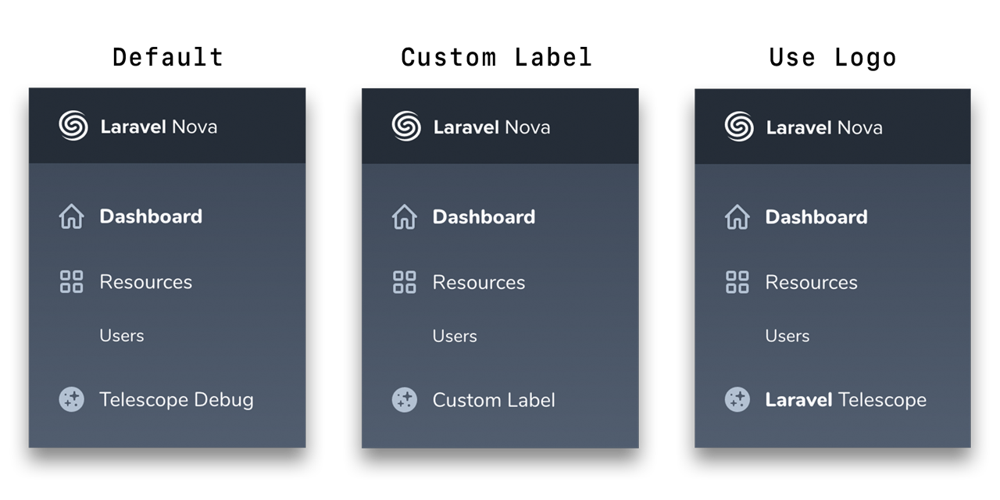

<p align="center">
    
</p>
<p align="center">Smart Link to <strong>Laravel Telescope Assistant</strong> from <strong>Laravel Nova</strong></p>
<p align="center">
    <a href="https://packagist.org/packages/mad-web/nova-telescope-link"></a>
    <a href="https://styleci.io/repos/154829430"></a>
    <a href="https://packagist.org/packages/mad-web/nova-telescope-link"></a>
    <a href="LICENSE.md"></a>
</p>

## Laravel Nova Telescope Smart Link

Ability to add link to the [Laravel Telescope](https://github.com/laravel/telescope)
Assistant in the [Laravel Nova](https://nova.laravel.com/) sidebar. Link automatically disables if current user hasn't access to the _Telescope Debug Assistant_ according
with access policy which is defined in gate `viewTelescope`. For more information, checkout the [documentation](https://github.com/laravel/telescope#dashboard-authorization).

## Demo

<p align="center">
    
</p>

## Installation

At first, install via composer:

```bash
composer require mad-web/nova-telescope-link
```

Next up, register the link in the `tools` method of the `NovaServiceProvider`:

```php
// app/Providers/NovaServiceProvider.php

// ...

public function tools()
{
    return [
        // ...
        new \MadWeb\NovaTelescopeLink\TelescopeLink,
    ];
}
```

## Customization

By default, link label is - **Telescope Debug**, if you prefer to customize it, just pass new label text into constructor:

```php
// app/Providers/NovaServiceProvider.php

// ...

public function tools()
{
    return [
        // ...
        new \MadWeb\NovaTelescopeLink\TelescopeLink('Custom Label'),
    ];
}
```

In addition, you may use _Telescope_ logo, just pass `null` or call `useLogo` method to provide more readable view:

```php
// app/Providers/NovaServiceProvider.php

// ...

public function tools()
{
    return [
        // ...

        new \MadWeb\NovaTelescopeLink\TelescopeLink(null),
        // or
        \MadWeb\NovaTelescopeLink\TelescopeLink::useLogo(),
    ];
}
```

## Contributing

Please see [CONTRIBUTING](CONTRIBUTING.md) and [CONDUCT](CONDUCT.md) for details.

## Security

If you discover any security related issues, please email [madweb.dev@gmail.com](mailto:madweb.dev@gmail.com) instead of using the issue tracker.

## Credits

- [Mad Web](https://github.com/mad-web)
- [All Contributors](../../contributors)

## License

The MIT License (MIT). Please see [License File](LICENSE.md) for more information.
